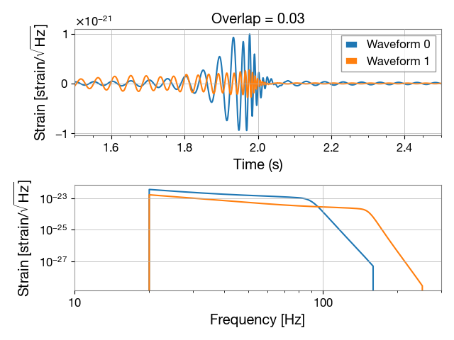
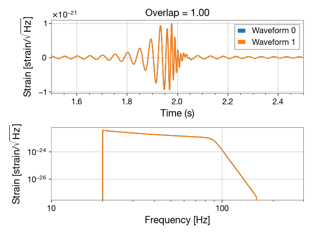

# GW Waveform Overlapper

This package helps users inject and study the overlap between GW waveforms. 

Small Overlap |  Complete Overlap
:-------------------------:|:-------------------------:
  |  
